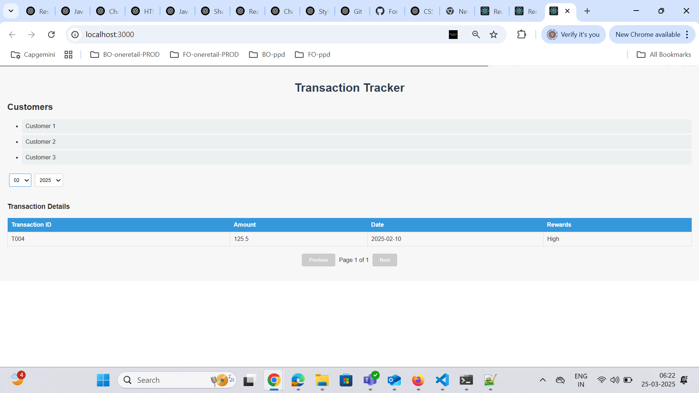

# Getting Started with Create React App

This project was bootstrapped with [Create React App](https://github.com/facebook/create-react-app).

## Available Scripts

In the project directory, you can run:

### `npm start`

Runs the app in the development mode.\
Open [http://localhost:3000](http://localhost:3000) to view it in your browser.

The page will reload when you make changes.\
You may also see any lint errors in the console.

### `npm test`

Launches the test runner in the interactive watch mode.\
See the section about [running tests](https://facebook.github.io/create-react-app/docs/running-tests) for more information.

### `npm run build`

Builds the app for production to the `build` folder.\
It correctly bundles React in production mode and optimizes the build for the best performance.

The build is minified and the filenames include the hashes.\
Your app is ready to be deployed!

See the section about [deployment](https://facebook.github.io/create-react-app/docs/deployment) for more information.

### `npm run eject`

**Note: this is a one-way operation. Once you `eject`, you can't go back!**

If you aren't satisfied with the build tool and configuration choices, you can `eject` at any time. This command will remove the single build dependency from your project.

Instead, it will copy all the configuration files and the transitive dependencies (webpack, Babel, ESLint, etc) right into your project so you have full control over them. All of the commands except `eject` will still work, but they will point to the copied scripts so you can tweak them. At this point you're on your own.

You don't have to ever use `eject`. The curated feature set is suitable for small and middle deployments, and you shouldn't feel obligated to use this feature. However we understand that this tool wouldn't be useful if you couldn't customize it when you are ready for it.

## Learn More

You can learn more in the [Create React App documentation](https://facebook.github.io/create-react-app/docs/getting-started).

To learn React, check out the [React documentation](https://reactjs.org/).

### Code Splitting

This section has moved here: [https://facebook.github.io/create-react-app/docs/code-splitting](https://facebook.github.io/create-react-app/docs/code-splitting)

### Analyzing the Bundle Size

This section has moved here: [https://facebook.github.io/create-react-app/docs/analyzing-the-bundle-size](https://facebook.github.io/create-react-app/docs/analyzing-the-bundle-size)

### Making a Progressive Web App

This section has moved here: [https://facebook.github.io/create-react-app/docs/making-a-progressive-web-app](https://facebook.github.io/create-react-app/docs/making-a-progressive-web-app)

### Advanced Configuration

This section has moved here: [https://facebook.github.io/create-react-app/docs/advanced-configuration](https://facebook.github.io/create-react-app/docs/advanced-configuration)

### Deployment

This section has moved here: [https://facebook.github.io/create-react-app/docs/deployment](https://facebook.github.io/create-react-app/docs/deployment)

### `npm run build` fails to minify

This section has moved here: [https://facebook.github.io/create-react-app/docs/troubleshooting#npm-run-build-fails-to-minify](https://facebook.github.io/create-react-app/docs/troubleshooting#npm-run-build-fails-to-minify)

Usage
Steps to Use the Application:
Customer Selection:

Upon visiting the application, you will see a list of customers on the left side.

Click on any customer to view their transaction details.

Filter Transactions by Month and Year:

Use the dropdown menus to filter transactions based on month and year.

By default, the "recent 3 months" filter and the year 2025 are selected. You can change these filters to see data for different months and years.

Viewing Transaction Details:

Transactions are displayed in a table with the following columns: Transaction ID, Amount, Date, and Rewards.

If no transactions match the selected filter, the message "Failed to fetch transactions" will be displayed.

Pagination:Transactions are paginated, displaying 3 transactions per page.

You can navigate through pages using the pagination buttons at the bottom of the table.

Error Handling:
If the API fetch fails, the error message "Failed to fetch transactions" will be shown.

When no transactions are available, the "Failed to fetch transactions" message will be displayed instead of a table.

Test Cases
Test Case 1: View Transactions for a Customer
Description: Ensure that transaction details are displayed when a customer is selected.

Expected Result: The transaction details should be displayed in a paginated table.

Screenshot:   

Test Case 2: Error Handling (Failed Fetch) and No Transactions Found

Description: Ensure that an error message is displayed when the transaction fetch fails.

Expected Result: The error message "Failed to fetch transactions" should be shown, and the table should not render.

Screenshot:
-

