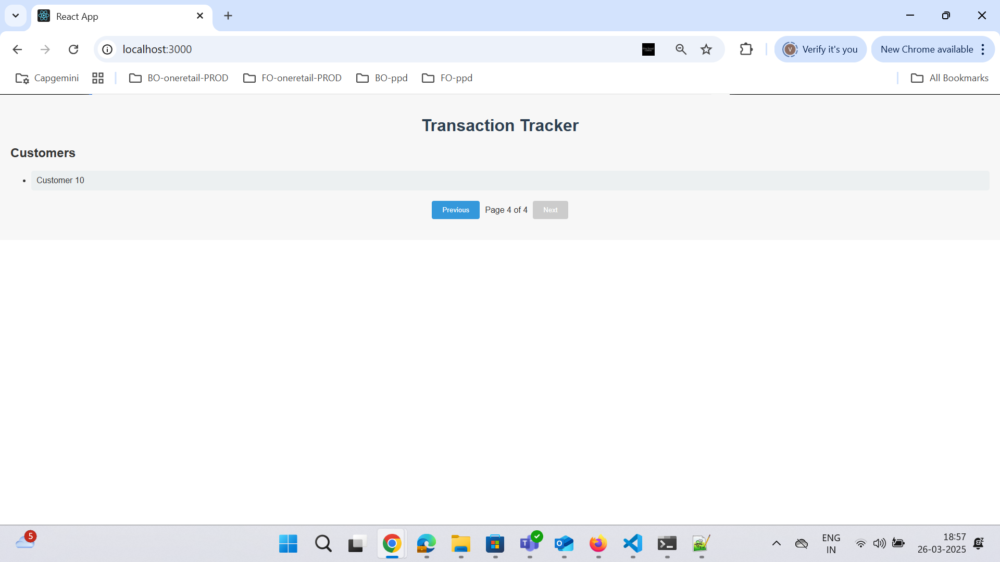

# Usage:

Steps to Use the Application:
Customer Selection:
Upon visiting the application, you will see a list of customers on the left side.
Click on any customer to view their transaction details.
Filter Transactions by Month and Year:
Use the dropdown menus to filter transactions based on month and year.

By default, the "recent 3 months" filter and the year 2025 are selected. You can change these filters to see data for different months and years.

## Installation
Follow the steps below to run the application locally:
1. Clone the repository:
   git clone https://github.com/Vinutha-KY/Rewards.git
   cd Rewards
   Install the required dependencies: npm install
   start the development server:npm start

# Viewing Transaction Details:
Transactions are displayed in a table with the following columns: Transaction ID, Amount, Date, and Rewards.
If no transactions match the selected filter, the message "No transactions" will be displayed.
Pagination:Transactions are paginated, displaying 3 transactions per page.
You can navigate through pages using the pagination buttons at the bottom of the table.

# Error Handling:
When no transactions are available, the "No transactions" message will be displayed instead of a table.

# Test Cases
Test Case 1: View Transactions for a Customer
Description: Ensure that transaction details are displayed when a customer is selected.
Expected Result: The transaction details should be displayed in a paginated table.
Screenshot:    

Test Case 2:  No Transactions 
Description: Ensure that an error message is displayed when the transaction fetch fails.
Expected Result: The error message "No transactions" should be shown, and the table should not render.

Screenshot:
-

